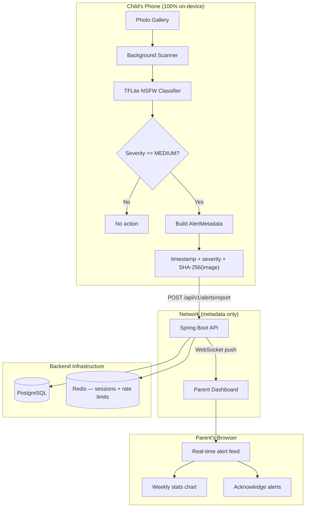

# SafeSnap

**On-device AI image safety for children's phones. Images never leave the device.**

SafeSnap is a full-stack parental control system built around a single privacy guarantee: the AI runs entirely on the child's phone, and only anonymised metadata is ever transmitted. No image bytes. No thumbnails. No cloud vision APIs. Just a SHA-256 hash, a severity score, and a timestamp.

## Live demo

| | URL |
|---|---|
| **Parent dashboard** | https://safesnap.vercel.app |
| **Backend API** | https://safesnap-backend.onrender.com |
| **Health check** | https://safesnap-backend.onrender.com/health |

> The backend runs on Render's free tier and may take ~30 seconds to wake on first request.

---

## Why this architecture matters

Most content-filtering apps work by uploading images to a cloud service for analysis. This creates a second privacy problem: you've solved one threat (inappropriate content) by creating another (your child's photos living on someone else's server). SafeSnap treats both as unacceptable.

The on-device approach is made possible by MobileNet-based TFLite models that run in under 100ms on a modern smartphone. The tradeoff is lower accuracy than a cloud model — but for a parental control app, a false negative is better than a privacy breach.

---

## System overview



**What travels over the network:**
```json
{
  "childDeviceId": "uuid",
  "timestamp": "2024-01-15T14:23:00Z",
  "severityScore": 0.87,
  "imageHash": "a3f8c2d1...",
  "severity": "HIGH"
}
```

That's it. The image hash lets the parent know a specific image was flagged without seeing it. The hash cannot be reversed to reconstruct the image.

---

## Monorepo structure

```
SafeSnap/
├── mobile/          # Flutter app (child's phone)
├── backend/         # Spring Boot 3 API
├── dashboard/       # React 18 parent dashboard
├── docs/            # Architecture, API spec, security model
├── docker-compose.yml
└── .env.example
```

---

## Quick start

### Try it now (no setup)

Open **https://safesnap.vercel.app**, create a parent account and explore the dashboard.  
The backend API is live at **https://safesnap-backend.onrender.com**.

### Run locally

#### Prerequisites
- Docker + Docker Compose
- Node 20+ (dashboard)
- Flutter 3.22+ (mobile)
- Java 17+ (if running backend outside Docker)

#### 1. Start backend infrastructure

```bash
cp .env.example .env
# Edit .env — at minimum change the JWT_SECRET:
# openssl rand -base64 64

docker compose up -d
```

The API will be at `http://localhost:8080`.

#### 2. Start the parent dashboard

```bash
cd dashboard
cp ../.env.example .env.local
npm install
npm run dev
```

Dashboard at `http://localhost:5173`.

#### 3. Run the Flutter app

```bash
cd mobile
flutter pub get
# Point at the live backend or your local one:
flutter run --dart-define=BASE_URL=https://safesnap-backend.onrender.com
```

For background scanning, run on a real device in release mode:
```bash
flutter build apk --dart-define=BASE_URL=https://safesnap-backend.onrender.com
```

---

## Architecture decisions

### Why TFLite + MobileNet?

MobileNet V2 quantised to INT8 is ~14MB and achieves ~85% AUROC on NSFW classification benchmarks. It runs in under 100ms on the CPU — no GPU required — which matters for battery life on background scans. The model ships inside the APK/IPA; there is no model download at runtime.

We use a conservative threshold: only severity `MEDIUM` (score ≥ 0.5) and above triggers a report. Parents can raise this to `HIGH` (0.7) in settings if they want fewer false positives.

### Why JWT + Redis instead of stateless JWT?

Pure stateless JWT cannot be revoked. If a child's device is lost or stolen, the parent needs to invalidate the pairing immediately. We store refresh tokens in Redis with a 7-day TTL. Invalidation is O(1): delete the key. Access tokens remain short-lived (15 min) so the blast radius of a leaked token is bounded.

### Why WebSocket for alerts?

Polling adds 30–60 seconds of latency in the default case. For a safety app, parents need to know in seconds, not minutes. WebSocket sessions are authenticated via the JWT passed as a query parameter on connect.

### Why feature-first folder structure?

Both the Flutter app and the React dashboard use feature-first (vertical slice) architecture rather than type-first (`components/`, `services/`, etc.). This makes it possible to reason about and modify a feature without touching files across 6 folders. Each feature is a candidate for extraction into its own package as the app grows.

---

## Running tests

```bash
# Backend
cd backend && mvn test

# Dashboard
cd dashboard && npm test

# Flutter
cd mobile && flutter test
```

---

## What's next

- **ML model improvement**: replace MobileNet with a fine-tuned EfficientNet model; target 95%+ AUROC
- **Video scanning**: frame-sample videos at 1fps for detection
- **iOS background limits**: implement BGProcessingTask for heavier scans on iOS
- **End-to-end encryption**: encrypt alert metadata with the parent's public key before transmission
- **Audit log**: immutable tamper-evident log of all alerts and parent actions

---

## Privacy guarantee

| Data | Stays on device? | Transmitted? | Stored server-side? |
|------|-----------------|--------------|---------------------|
| Image bytes | ✅ Always | ❌ Never | ❌ Never |
| Image thumbnail | ✅ Always | ❌ Never | ❌ Never |
| Image hash (SHA-256) | ✅ Yes | ✅ Yes (metadata only) | ✅ Yes |
| Severity score | ✅ Yes | ✅ Yes | ✅ Yes |
| Timestamp | ✅ Yes | ✅ Yes | ✅ Yes |
| Parent email | — | ✅ Registration only | ✅ Hashed |
| Child device ID | ✅ Yes | ✅ Yes (pairing) | ✅ Yes |

See [docs/SECURITY.md](docs/SECURITY.md) for the full threat model.
